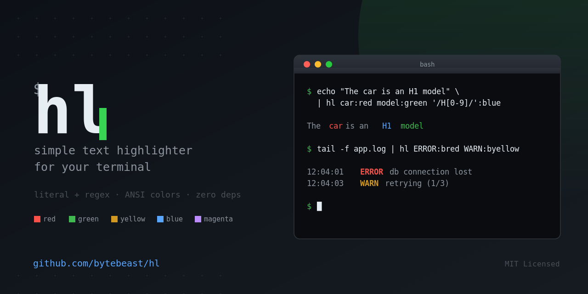

<div align="center">

# hl

**A tiny, zero-dependency text highlighter for your terminal.**

Pipe anything into `hl` and color-highlight words, tokens, or regex patterns
with ANSI colors - great for `tail -f` logs, grepping, and general terminal
life.

[](https://www.gnu.org/software/bash/)
[](https://github.com/bytebeast/hl)
[](#requirements)
[](#requirements)
[](LICENSE)
[](https://github.com/bytebeast/hl/commits)
[](https://github.com/bytebeast/hl/issues)
[](CONTRIBUTING.md)
[](https://github.com/bytebeast/hl/stargazers)

</div>

---

## Preview



## Features

- **Literal or regex matching** - plain words by default, or wrap a pattern in
  `/.../` for `sed` BRE regex
- **Multiple patterns per call**, applied left to right (up to 12)
- **Overlapping matches nest** - when one pattern highlights inside another, the
  outer color is restored afterwards instead of being cleared
- **14 colors**, including bright variants with short aliases (`bred`, `bgreen`,
  ...)
- **Zero dependencies** - pure Bash + `sed` + `awk` + `tput`/ANSI, nothing to
  install
- **Streaming** - output appears line by line, so `tail -f | hl` and other live
  pipelines work as you would expect
- **Pipe-friendly** - reads stdin, writes stdout, plays nicely with `tail`,
  `grep`, `journalctl`, CI logs, anything text-based

## Requirements

- `bash` (4.0+)
- `sed`
- `awk` (any POSIX awk - `mawk`, `gawk`, and BSD `awk` all work)
- `tput` (optional - falls back to raw ANSI escape codes if unavailable)

No package manager, no runtime, no build step.

> **macOS note:** `hl` works with the system BSD `sed`, but a few regex
> constructs (`\|`, `\+`, `\?`) are GNU extensions and will not match under it.
> See [Regex support](#regex-support). `brew install gnu-sed` and putting
> `gnubin` on your `PATH` gets you the full set.

## Installation

**Quick install (curl):**

```bash
sudo curl -fsSL https://raw.githubusercontent.com/bytebeast/hl/main/hl -o /usr/local/bin/hl
sudo chmod +x /usr/local/bin/hl
```

**Clone and link:**

```bash
git clone https://github.com/bytebeast/hl.git
cd hl
chmod +x hl
ln -s "$(pwd)/hl" /usr/local/bin/hl   # or anywhere on your $PATH
```

Verify it's on your `PATH`:

```bash
hl <<< "installed correctly"
```

## Usage

```
echo "text" | hl pattern:color [pattern:color ...]
hl -h | --help
```

- **Literal match** (default): `hl word:red`
- **Regex match** (wrap the pattern in `/.../`, `sed` BRE syntax):
  `hl '/H[0-9]/':blue`

The color is taken from the **last** colon in the argument, so patterns may
contain colons themselves (`hl 'level:error:bred'` highlights `level:error`).

Bad input is a hard error: an unknown color, a missing colon, or more than 12
patterns exits with status `2` and a message on stderr.

### Examples

```bash
# Highlight a single word
echo "The car is an H1 model" | hl car:red

# Highlight using a regex
echo "The car is an H1 model" | hl '/H[0-9]/':blue

# Stack multiple patterns
echo "The car is an H1 model" | hl car:red model:green '/H[0-9]/':blue

# Tail a log and flag errors/warnings in bright colors
tail -f app.log | hl ERROR:bred WARN:byellow INFO:cyan

# Alternation (GNU sed)
journalctl -f | hl '/error\|fatal\|panic/':bred

# Timestamps - note the colons inside the pattern
hl '/[0-9]\{2\}:[0-9]\{2\}:[0-9]\{2\}/':bcyan < app.log

# IP addresses
hl '/[0-9]\{1,3\}\.[0-9]\{1,3\}\.[0-9]\{1,3\}\.[0-9]\{1,3\}/':bmagenta < access.log

# Works with anything piped over stdout
grep -i "timeout" server.log | hl timeout:bred
```

## Colors

| Name      | Alias | Name             | Alias      |
| --------- | ----- | ---------------- | ---------- |
| `black`   |       | `bright_red`     | `bred`     |
| `red`     |       | `bright_green`   | `bgreen`   |
| `green`   |       | `bright_yellow`  | `byellow`  |
| `yellow`  |       | `bright_blue`    | `bblue`    |
| `blue`    |       | `bright_magenta` | `bmagenta` |
| `magenta` |       | `bright_cyan`    | `bcyan`    |
| `cyan`    |       |                  |            |
| `white`   |       |                  |            |

## Regex support

Regex mode uses `sed` **BRE** syntax, not PCRE. The portable subset works
everywhere; the GNU column is what you get from GNU `sed` on Linux, and what
macOS's BSD `sed` will silently fail to match.

| Construct                       | Meaning                     | Availability |
| ------------------------------- | --------------------------- | ------------ |
| `.`                             | Any character               | POSIX        |
| `*`                             | Zero or more                | POSIX        |
| `[abc]` `[^abc]` `[[:digit:]]`  | Bracket expressions         | POSIX        |
| `^` `$`                         | Anchors                     | POSIX        |
| `\(...\)`                       | Group                       | POSIX        |
| `\1` ... `\9`                   | Backreference               | POSIX        |
| `\{n\}` `\{n,\}` `\{n,m\}`      | Intervals                   | POSIX        |
| `\|`                            | Alternation                 | **GNU only** |
| `\+` `\?`                       | One-or-more, zero-or-one    | **GNU only** |
| `\w` `\s` `\b`                  | Shorthand classes           | **GNU only** |

There is no `\d`. Use `[0-9]` or `[[:digit:]]`.

Note that `+`, `?`, `{`, `}`, `(`, `)` and `|` are **literal** characters in
BRE - you escape them to make them special, which is the opposite of PCRE.

## Notes

- **Literal mode escapes every BRE metacharacter** (`\ . * [ ^ $`), so
  `hl 'a.b:red'` matches the three-character string `a.b` and not `axb`.
- **Overlapping patterns nest properly.** Later patterns can highlight inside
  text an earlier pattern already colored, and the enclosing color resumes when
  the inner match ends.
- **Colors gracefully degrade**: if `tput` isn't available, `hl` falls back to
  raw ANSI escape sequences.
- `hl` with no arguments passes stdin straight through.

### Limitations

- **`/.../ ` is ambiguous with paths.** `hl '/usr/:red'` is read as the regex
  `usr`, not the literal string `/usr/`. To match the slashes, stay in regex
  mode and bracket them: `hl '/[/]usr[/]/':red`.
- **A `$` anchor may miss** if an earlier pattern already highlighted the end of
  the line.
- **`.` and negated classes like `[^x]` can match the internal marker bytes**
  `hl` uses to track highlights, which can produce odd output when combined with
  earlier patterns.
- **Maximum 12 `pattern:color` pairs** per invocation.

## Contributing

Issues and pull requests are welcome. If you're proposing a larger change,
please open an issue first to discuss what you'd like to change.

## License

Released under the [MIT License](LICENSE).

---

<div align="center">

If `hl` saved you some `grep -A -B` gymnastics or made your logs easier to read,
**please consider giving it a ⭐ star** - it helps other people find the project
and keeps it maintained.

</div>
